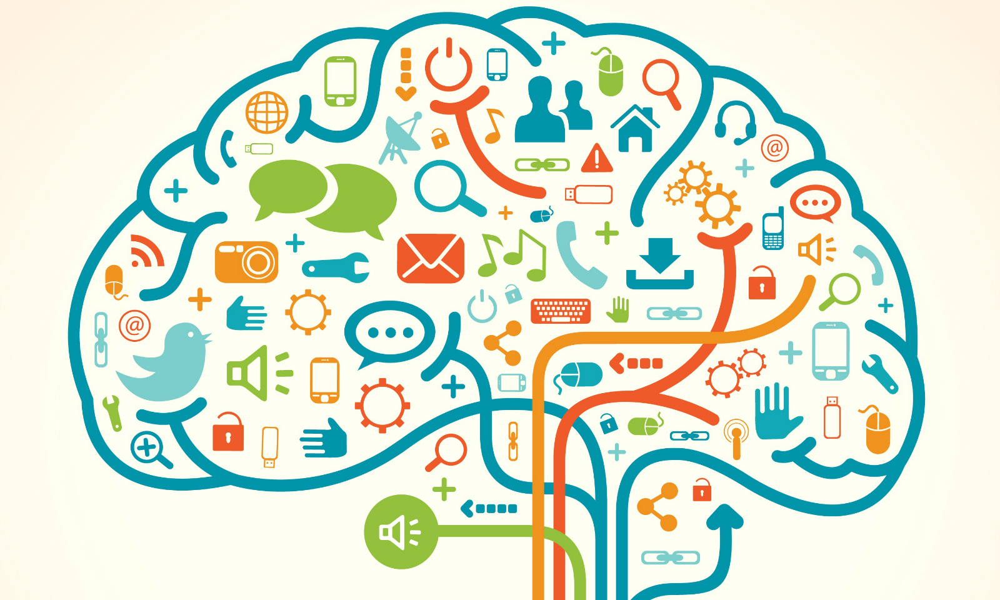
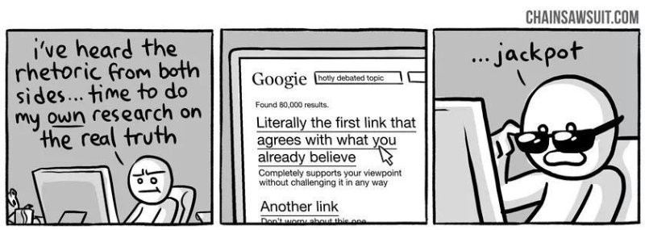

## Decision-making for teams
### How to overcome cognitive biases

by Tobias Käfer

Software Architect MyWebsite Infrastructure

Note:
Introduce yourself.

---

## Cognitive Bias?

---

 <!-- .element style="height: 500px" -->

[source https://en.wikipedia.org/wiki/File:Cognitive_Bias_Codex_-_180%2B_biases,_designed_by_John_Manoogian_III_(jm3).jpg](http://bit.ly/CogBiasCodex) <!-- .element style="font-size: 0.4em;" -->

Note:
The notion of cognitive biases was introduced by Amos Tversky and Daniel Kahneman in 1972

---

Feels like:
 <!-- .element style="height: 500px" -->
[source http://stdaily.ghost.io/knowledge-matters/](http://stdaily.ghost.io/knowledge-matters/) <!-- .element style="font-size: 0.4em;" -->

---

Bias arises from various processes that are sometimes difficult to distinguish. These include

* information-processing shortcuts (heuristics)
* noisy information processing (distortions in the process of storage in and retrieval from memory)
* the brain's limited information processing capacity
* emotional and moral motivations
* social influence

[source https://en.wikipedia.org/wiki/Cognitive_bias](https://en.wikipedia.org/wiki/Cognitive_bias) <!-- .element style="font-size: 0.4em;" -->

---

Biases can be distinguished on a number of dimensions. For example,

* there are biases specific to groups (such as the risky shift) as well as biases at the individual level.
* Some biases affect decision-making, where the desirability of options has to be considered (e.g., sunk costs fallacy).
* Others such as illusory correlation affect judgment of how likely something is, or of whether one thing is the cause of another.
* A distinctive class of biases affect memory, such as consistency bias (remembering one's past attitudes and behavior as more similar to one's present attitudes).

[source https://en.wikipedia.org/wiki/Cognitive_bias](https://en.wikipedia.org/wiki/Cognitive_bias) <!-- .element style="font-size: 0.4em;" -->

---

 

[source http://chainsawsuit.com/comic/2014/09/16/on-research/](http://chainsawsuit.com/comic/2014/09/16/on-research/) <!-- .element style="font-size: 0.4em;" -->

---
